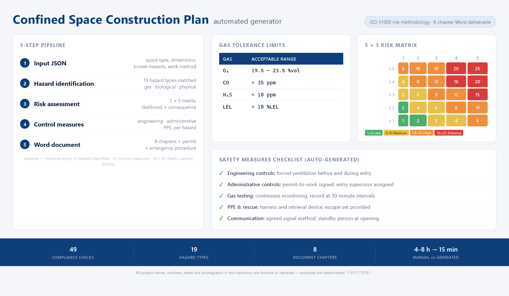

<div align="center">

# Confined Space Planner

### Automated confined space construction plan generator with regulatory compliance

[](https://python.org)
[](LICENSE)
[](CONTRIBUTING.md)
[](https://github.com/gba-mep)

**Compliance-ready in minutes** | **Risk assessment + Permit + Emergency plan** | **ISO 31000 aligned**



*5-step pipeline: Input JSON → Hazard Match (19 types) → Risk Matrix (5×5 ISO 31000) → Control Measures (engineering/administrative/PPE) → Word Document (8 chapters) + 49-item compliance check*

</div>

---


> **🔒 Demo data notice** — the preview image, the JSON files under [`examples/`](examples/) and the generated Word samples all use **fictional project data** (placeholder site names, generic dimensions). No real permit numbers, client names or site locations are published here. No real site photographs are used.
## The Problem

Every confined space construction project legally requires a comprehensive safety plan covering:
- Risk assessment with hazard identification
- Work permits with 17 mandatory safety measures
- Control measures (engineering / administrative / PPE)
- Emergency rescue procedures
- Regulatory compliance documentation

Consultants charge **$5,000-$10,000** per plan. Each plan takes **4-8 hours** to write manually.

## The Solution

This tool generates a complete, compliant confined space construction plan from 4 simple inputs:

```
Project info + Space description + Work content + Special requirements
                              ↓
                    5-step pipeline
                              ↓
     Risk Assessment → Permit → Safety Measures → Emergency Plan → Word doc
```

### What it produces:

| Document Section | Content |
|-----------------|---------|
| Cover page | Project info, contractor, permit number |
| Regulatory basis | Safety regulations, ISO 31000 compliance |
| Project overview | Location, space type, dimensions, access |
| Risk assessment | Hazard library, gas tolerance standards, risk matrix |
| Work permit | 17 mandatory safety measures checklist |
| Control measures | Engineering / Administrative / PPE per hazard |
| Emergency plan | Rescue procedures, equipment, contacts |
| Attachments | Compliance checklist, training records |

## Quick Start

```bash
git clone https://github.com/gba-mep/confined-space-planner.git
cd confined-space-planner
pip install -r requirements.txt

# Generate a plan from example input
python generate_plan.py --input examples/manhole_input.json --output plan.docx --matrix
```

Output:
```
[1/5] Situation analysis...      ✓ Space type: manhole, 6 hazards identified
[2/5] Hazard identification...   ✓ H₂S: score=20 (Extreme), O₂: score=20 (Extreme)
[3/5] Control measures...       ✓ 41 measures across 6 hazards
[4/5] Document writing...        ✓ 8-chapter Word doc assembled
[5/5] Compliance review...       ✓ 44/49 passed (89.8%) — CONDITIONAL PASS
```

### Create Your Own Input

```json
{
  "project_info": {
    "name": "Your Project — Cable Installation",
    "location": "Site Address",
    "contractor": "Contractor Name"
  },
  "space_description": {
    "type": "manhole",
    "dimensions": "1.2m x 1.0m x 2.5m",
    "access": "top opening, 600mm",
    "structure": "concrete",
    "surroundings": "underground corridor"
  },
  "work_content": {
    "nature": "cable installation",
    "workers": 3,
    "duration": "4 hours",
    "materials": "cables, tools, lighting"
  },
  "special_requirements": {
    "owner_requirements": "gas monitoring every 30 min",
    "known_hazards": ["H2S", "oxygen_deficiency"]
  }
}
```

```bash
python generate_plan.py --input your_input.json --output your_plan.docx --json
```

### CLI Options

| Flag | Description |
|------|-------------|
| `--input, -i` | Path to input JSON file (required) |
| `--output, -o` | Output .docx path (default: confined_space_plan.docx) |
| `--json` | Also export plan data as JSON |
| `--matrix` | Print risk matrix to console |

## 5-Step Pipeline

| Step | Action |
|------|--------|
| 1. Situation Analysis | Parse inputs, identify space type and constraints |
| 2. Hazard Identification | Match against hazard library (gas, biological, physical) |
| 3. Control Measures | Generate engineering/administrative/PPE recommendations |
| 4. Document Writing | Assemble complete Word document with all sections |
| 5. Compliance Review | Check against 17-point regulatory checklist |

## Hazard Library

Pre-built hazard categories:

| Category | Examples |
|----------|---------|
| Atmospheric | O₂ deficiency (<19.5%), H₂S, CO, flammable gases |
| Biological | Sewage, mold, animal waste |
| Physical | Engulfment, falls, thermal stress, noise |
| Electrical | Live cables, static discharge |
| Chemical | Residual chemicals, cleaning agents |

## Documentation

| File | Content |
|------|---------|
| [SKILL.md](SKILL.md) | Complete skill specification and workflow |
| [references/input-requirements.md](references/input-requirements.md) | 4-category input specification |
| [references/process-flow.md](references/process-flow.md) | 5-step detailed process |
| [references/regulations-summary.md](references/regulations-summary.md) | Regulatory framework summary |
| [references/hazard-library.md](references/hazard-library.md) | Hazard identification + gas standards + risk matrix |
| [references/control-measures.md](references/control-measures.md) | Control measures library |
| [references/document-templates.md](references/document-templates.md) | 3 document template structures |
| [references/compliance-checklist.md](references/compliance-checklist.md) | Compliance verification checklist |

## Use Cases

- Manhole / sewer work
- Water tank inspection and maintenance
- Pipe/culvert work
- Underground utility corridor work
- Duct and shaft work
- Any confined space operation requiring safety documentation

## Example Outputs

| Example | Space Type | Hazards | Controls | Compliance |
|---------|-----------|---------|----------|-----------|
| [manhole_input.json](examples/manhole_input.json) | Manhole | 6 (H₂S, O₂, drowning, CO, fall, engulfment) | 41 measures | 44/49 (89.8%) |
| [water_tank_input.json](examples/water_tank_input.json) | Water tank | 5 (O₂, electrocution, fall, biological, drowning) | 40 measures | 44/49 (89.8%) |

```bash
# Try the examples
python generate_plan.py --input examples/manhole_input.json --output manhole_plan.docx
python generate_plan.py --input examples/water_tank_input.json --output water_tank_plan.docx
```

## Project Structure

```
confined-space-planner/
├── generate_plan.py              # Main CLI entry point
├── lib/
│   ├── hazard_matcher.py         # Step 1-2: Space analysis + hazard identification
│   ├── risk_calculator.py        # Step 2: ISO 31000 risk matrix + ventilation calc
│   ├── control_generator.py      # Step 3: Engineering/administrative/PPE measures
│   ├── compliance_checker.py     # Step 5: 49-item regulatory checklist
│   └── doc_builder.py            # Step 4: Word document assembly (8 chapters)
├── examples/
│   ├── manhole_input.json        # Example: manhole cable installation
│   └── water_tank_input.json     # Example: water tank cleaning
├── references/                   # Knowledge base (hazard library, regulations, templates)
│   ├── hazard-library.md
│   ├── control-measures.md
│   ├── regulations-summary.md
│   ├── document-templates.md
│   ├── compliance-checklist.md
│   ├── input-requirements.md
│   └── process-flow.md
└── requirements.txt              # python-docx
```

## License

MIT License — see [LICENSE](LICENSE)

## Sponsor

If this tool saved you time, consider [sponsoring](https://github.com/sponsors/gba-mep) the project.

<div align="center">

⭐ Star this repo if it helped!

</div>

---

## Related repositories

Part of the **[MEP & construction document automation toolkit](https://github.com/gba-mep)** — open-source tools built from real jobsite workflows.

- **Handbook** — [ai-agent-manual](https://github.com/gba-mep/ai-agent-manual) (8-level AI cultivation for engineers)
- **Document generation** — [material-approval-pipeline](https://github.com/gba-mep/material-approval-pipeline) · [material-submittal-generator](https://github.com/gba-mep/material-submittal-generator) · [excel-template-filler](https://github.com/gba-mep/excel-template-filler) · [python-docx-photo-grid](https://github.com/gba-mep/python-docx-photo-grid) · [daily-construction-log](https://github.com/gba-mep/daily-construction-log) · [officecli-workflow](https://github.com/gba-mep/officecli-workflow)
- **Engineering calculation** — [lighting-lux-calculator](https://github.com/gba-mep/lighting-lux-calculator) · [ups-discharge-time-calculator](https://github.com/gba-mep/ups-discharge-time-calculator) · [gantt-chart-pro](https://github.com/gba-mep/gantt-chart-pro) · [electrical-test-report-generator](https://github.com/gba-mep/electrical-test-report-generator)
- **CAD & drawings** — [electrical-panel-label-plates](https://github.com/gba-mep/electrical-panel-label-plates)
- **Data & OCR** — [ocr-skill](https://github.com/gba-mep/ocr-skill) · [VBA-Macro-Reader-v2.0.0](https://github.com/gba-mep/VBA-Macro-Reader-v2.0.0)
- **Compliance & AI ops** — [路由规则](https://github.com/gba-mep/路由规则) · [consulting-services](https://github.com/gba-mep/consulting-services)
