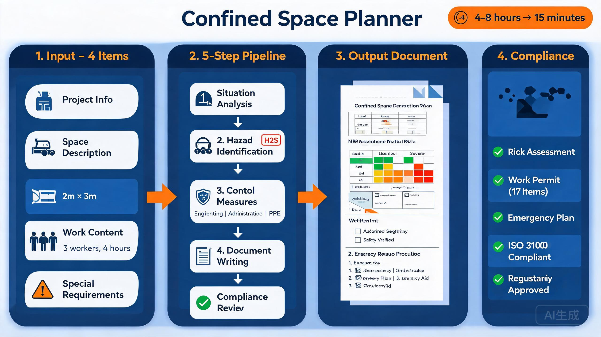

<div align="center">

# Confined Space Planner

### Automated confined space construction plan generator with regulatory compliance

[](https://python.org)
[](LICENSE)
[](CONTRIBUTING.md)

**Compliance-ready in minutes** | **Risk assessment + Permit + Emergency plan** | **ISO 31000 aligned**



*4-step pipeline: 4 inputs (project/space/work/requirements) → 5-step process (analyze→identify→control→write→review) → Word document → compliance check*

</div>

---

## The Problem

Every confined space construction project legally requires a comprehensive safety plan covering:
- Risk assessment with hazard identification
- Work permits with 17 mandatory safety measures
- Control measures (engineering / administrative / PPE)
- Emergency rescue procedures
- Regulatory compliance documentation

Consultants charge **$5,000-$10,000** per plan. Each plan takes **4-8 hours** to write manually.

## The Solution

This tool generates a complete, compliant confined space construction plan from 4 simple inputs:

```
Project info + Space description + Work content + Special requirements
                              ↓
                    5-step pipeline
                              ↓
     Risk Assessment → Permit → Safety Measures → Emergency Plan → Word doc
```

### What it produces:

| Document Section | Content |
|-----------------|---------|
| Cover page | Project info, contractor, permit number |
| Regulatory basis | Safety regulations, ISO 31000 compliance |
| Project overview | Location, space type, dimensions, access |
| Risk assessment | Hazard library, gas tolerance standards, risk matrix |
| Work permit | 17 mandatory safety measures checklist |
| Control measures | Engineering / Administrative / PPE per hazard |
| Emergency plan | Rescue procedures, equipment, contacts |
| Attachments | Compliance checklist, training records |

## Quick Start

```bash
git clone https://github.com/David-CB666/confined-space-planner.git
cd confined-space-planner
pip install -r requirements.txt
```

Provide 4 categories of information:

```python
project_info = {
    "name": "[Project Name]",
    "location": "[Site Address]",
    "contractor": "[Contractor Name]",
}

space_description = {
    "type": "manhole",  # or "water_tank", "pipe", "duct"
    "dimensions": "1.2m × 1.0m × 2.5m",
    "access": "top opening, 600mm diameter",
    "structure": "concrete",
    "surroundings": "underground utility corridor",
}

work_content = {
    "nature": "cable installation",
    "workers": 3,
    "duration": "4 hours",
    "materials": "cables, tools, lighting",
}

special_requirements = {
    "owner_requirements": "gas monitoring every 30 min",
    "known_hazards": "possible H2S, low oxygen",
}
```

## 5-Step Pipeline

| Step | Action |
|------|--------|
| 1. Situation Analysis | Parse inputs, identify space type and constraints |
| 2. Hazard Identification | Match against hazard library (gas, biological, physical) |
| 3. Control Measures | Generate engineering/administrative/PPE recommendations |
| 4. Document Writing | Assemble complete Word document with all sections |
| 5. Compliance Review | Check against 17-point regulatory checklist |

## Hazard Library

Pre-built hazard categories:

| Category | Examples |
|----------|---------|
| Atmospheric | O₂ deficiency (<19.5%), H₂S, CO, flammable gases |
| Biological | Sewage, mold, animal waste |
| Physical | Engulfment, falls, thermal stress, noise |
| Electrical | Live cables, static discharge |
| Chemical | Residual chemicals, cleaning agents |

## Documentation

| File | Content |
|------|---------|
| [SKILL.md](SKILL.md) | Complete skill specification and workflow |
| [references/input-requirements.md](references/input-requirements.md) | 4-category input specification |
| [references/process-flow.md](references/process-flow.md) | 5-step detailed process |
| [references/regulations-summary.md](references/regulations-summary.md) | Regulatory framework summary |
| [references/hazard-library.md](references/hazard-library.md) | Hazard identification + gas standards + risk matrix |
| [references/control-measures.md](references/control-measures.md) | Control measures library |
| [references/document-templates.md](references/document-templates.md) | 3 document template structures |
| [references/compliance-checklist.md](references/compliance-checklist.md) | Compliance verification checklist |

## Use Cases

- Manhole / sewer work
- Water tank inspection and maintenance
- Pipe/culvert work
- Underground utility corridor work
- Duct and shaft work
- Any confined space operation requiring safety documentation

## License

MIT License — see [LICENSE](LICENSE)

## Sponsor

If this tool saved you time, consider [sponsoring](https://github.com/sponsors/David-CB666) the project.

<div align="center">

⭐ Star this repo if it helped!

</div>
